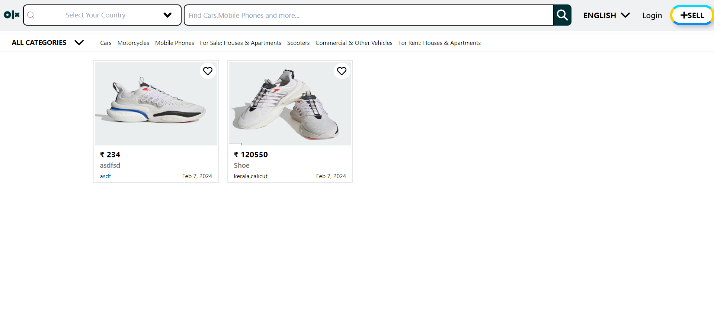

# OLX Clone

## Overview

This project is a clone of the popular online marketplace OLX. It allows users to register, log in, and post products for sale. Built using React.js, Firebase for authentication and database management, and Tailwind CSS for styling, this project offers a modern and responsive user experience.

## Features

- **User Registration**: Users can create a new account with a valid email address and password.
- **User Authentication**: Secure user authentication powered by Firebase Authentication ensures only authorized users can access the platform.
- **User Login**: Registered users can log in to their accounts using their email and password.
- **Product Listing**: Authenticated users can list products for sale, providing details such as title, description, price, and images.
- **Responsive Design**: Utilizing Tailwind CSS, the application offers a responsive design that adapts to various screen sizes and devices.

## Technologies Used

- **React.js**: A popular JavaScript library for building user interfaces.
- **Firebase**: Provides backend services like authentication, real-time database, and hosting.
- **Tailwind CSS**: A utility-first CSS framework for quickly building custom designs.

## Screenshots

</img>
## Getting Started

Follow these instructions to get a copy of the project up and running on your local machine for development and testing purposes.

1. **Clone the repository**:

   ```bash
   git clone https://github.com/your-username/olx-clone.git


